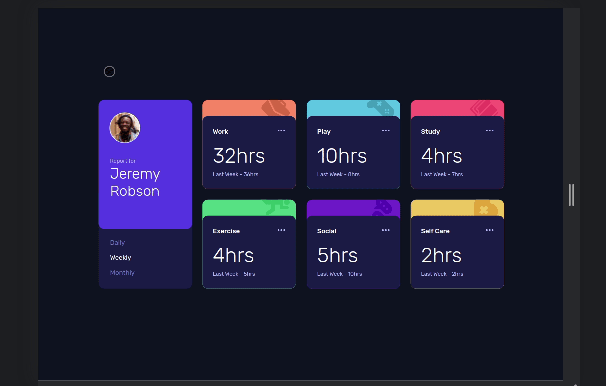

# Frontend Mentor - Time tracking dashboard solution

This is a solution to the [Time tracking dashboard challenge on Frontend Mentor](https://www.frontendmentor.io/challenges/time-tracking-dashboard-UIQ7167Jw). Frontend Mentor challenges help you improve your coding skills by building realistic projects.

## Table of contents

- [Overview](#overview)
  - [The challenge](#the-challenge)
  - [Screenshot](#screenshot)
  - [Links](#links)
- [My process](#my-process)
  - [Built with](#built-with)
  - [What I learned](#what-i-learned)
  - [Useful resources](#useful-resources)
- [Author](#author)

## Overview

This is the front-end mentor's seventeen challenge. The challenge is to build the "Time tracking dashboard" and make it as close to the design as possible. Building the desing with whatever you want to finish, any language, framework or tools.

### The challenge

Users should be able to:

- View the optimal layout for the component depending on their device's screen size
- See a hover state on desktop for the Sign Up call-to-action

## Screenshot

### Mobile design

<p  align="center">
  </img>
</p>

### Tablets design

<p  align="center"></img></p>

### Desktop design

<p  align="center"></img></p>

### result of my work

<p  align="center"></img></p>
<p  align="center"></img></p>

### Links

- Solution URL: [My solution for this challenge](https://www.frontendmentor.io/solutions/time-tracking-with-reactjs-styledcomponents-axios-and-json-server-owqITEvvD)
- Live Site URL: [check the result](https://jcdmeira-time-tracking-dashboard.netlify.app)

- My figma design: [Figma](https://www.figma.com/file/CsbY47xzwm6T3uiqYTPCQN/17-time-tracking-dashboard?node-id=3%3A8)

## My process

### Built with

- Mobile-first workflow
- Grid
- Grid templete areas
- [React](https://reactjs.org/) - JS library
- [Styled components](https://styled-components.com) - CSS in js with stiled components
- [JSON server](https://www.npmjs.com/package/json-server) - Fake API with JSON server
- [Axio](https://www.npmjs.com/package/axios) - Requests with axios

### What I learned

O arquivo de context sustenta os estados globais da aplicação, como os dados que server para preencher os cards.
O useEffect com array vazio faz o papel de atualizar uma vez após a renderização da página, pegando os dados da fake API.
E então os cards são renderizados com os dados adequados.

| The context file holds the application's global states, such as the data it serves to populate the cards.
| The useEffect with empty array plays the role of updating once after rendering the page, taking the data from the fake API.
| And then cards are rendered with the proper dice.

```JS
 import React, { createContext, useContext, useEffect, useState } from 'react';
import P from 'prop-types';
import { api } from '../services/api';

const ActivitysContexts = createContext();

const ActivitysProvider = ({ children }) => {
  const [name, setName] = useState(null);
  const [activitys, setActivitys] = useState([]);
  const [period, setPeriod] = useState([]);
  const [searchPeriod, setSearchPeriod] = useState('weekly');

  useEffect(() => {
    function findInfoPeriod(obj, searchPeriod, store = []) {
      const myStore = store;
      return Object.keys(obj).map((key) => {
        if (key === searchPeriod) {
          myStore.push(obj[key]);
        }
        if (obj[key]) {
          if (typeof obj[key] == 'object' || Array.isArray(obj[key])) {
            findInfoPeriod(obj[key], searchPeriod, myStore);
          }
        }
        return myStore[myStore.length - 1];
      });
    }

    const recursiveResult = findInfoPeriod(activitys, searchPeriod);
    setPeriod(recursiveResult);
  }, [activitys, searchPeriod]);

  useEffect(() => {
    api.get('/profiles').then((response) => {
      setActivitys(response.data[0].activitys);
      setName(response.data[0].name);
    });
  }, []);

  return (
    <ActivitysContexts.Provider
      value={{
        name,
        setName,
        activitys,
        setActivitys,
        period,
        setPeriod,
        searchPeriod,
        setSearchPeriod,
      }}
    >
      {children}
    </ActivitysContexts.Provider>
  );
};

const ActivitysConsumer = () => useContext(ActivitysContexts);

export { ActivitysContexts, ActivitysProvider, ActivitysConsumer };

ActivitysProvider.propTypes = {
  children: P.object.isRequired,
};

```

O segundo useEffect atualiza de acordo com quando as dependências mudam, e está associado a função de busca abaixo.
Essa função é uma algoritmo de Backtracking, que faz uma busca recursiva. Está sendo usada para aplicar, mesmo que no caso
em questão não seria necessário, pois se sabe exatamente o formato e a dimensão do JSON que chega pela requisição, e este não
se altera.
A função recebe o obj que será feita a busca, a palavra que vai buscar dentro das chaves e um parâmetro store, que serve para
orientar a pesquisa, salvando os resultados válidos. Este recebe o valor formal de um array vazio, portanto se não houver um valor
real passado na chamada da função ele adotará array vazio como valor.
O objeto é recebido por uma constante, e se a chave for válida será adicionado o valor ao array, e sempre que houver um novo nível
e for chamado a recursividade o myStore será passado como parâmetro para a função, mantendo a integridade de seu valor.
Ao final essa busca é retornada, contendo as horas do estado atual e anterior, que será salvo em um estado global para ser usado.

| The second useEffect updates as dependencies change, and is associated with the search function below.
| This function is a Backtracking algorithm, which performs a recursive search. It is being used to apply, even if in the case
| in question would not be necessary, as it is known exactly the format and dimension of the JSON that arrives by the request, and this
| one does not
| changes.
| The function receives the obj that will be searched, the word that will be searched inside the braces and a store parameter, which
| serves to
| guide the search by saving the valid results. This takes the formal value of an empty array, so if there is no value
| real passed in the function call it will adopt empty array as value.
| The object is received by a constant, and if the key is valid, the value will be added to the array, and whenever there is a new level
| and recursion is called, myStore will be passed as a parameter to the function, keeping the integrity of its value.
| At the end this search is returned, containing the hours of the current and previous state, which will be saved in a global state to
| be used.

```JS
 function findInfoPeriod(obj, searchPeriod, store = []) {
      const myStore = store;
      return Object.keys(obj).map((key) => {
        if (key === searchPeriod) {
          myStore.push(obj[key]);
        }
        if (obj[key]) {
          if (typeof obj[key] == 'object' || Array.isArray(obj[key])) {
            findInfoPeriod(obj[key], searchPeriod, myStore);
          }
        }
        return myStore[myStore.length - 1];
      });
    }
```

Se o name for null quer dizer que a requisição não voltou ainda, então um "loading spinner" íra aparecer na tela, caso não
os cards são renderizados.
o name e period contém um short circuit para evitar erros, caso o nome seja null ou algum outro valor considerado falsy, para ambos os casos.
O map em activitys retorna os card de atividade, sendo que o título é atribuido via desestruturação do JSON e o period é pego acessando
o estado global já criado, que segue a mesma ordem dos cards a serem renderizados.

| If the name is null it means that the request has not returned yet, then a "loading spinner" will appear on the screen, if not
| cards are rendered.
| the name and period contain a short circuit to avoid errors, if the name is null or some other value considered false, for both cases.
| The map in activitys returns the activity cards, the title is assigned via JSON destructuring and the period is taken by accessing
| the global state already created, which follows the same order as the cards to be rendered.

```JSX
import React from 'react';

import { ActivityCard } from './components/ActivityCard';
import { AvatarCard } from './components/AvatarCard';
import { Content } from './components/Content';

import { Conteiner, GlobalStyle } from './Global';

import { ActivitysConsumer } from './Contexts/ActivitysContext';

function App() {
  const { name, activitys, period } = ActivitysConsumer();

  return (
    <>
      <GlobalStyle />
      <Conteiner>
        <Content>
          {name === null ? (
            <div className="c-loader"></div>
          ) : (
            <>
              <AvatarCard name={name || ''} />
              {activitys?.map(({ title }, index) => (
                <ActivityCard
                  key={index}
                  tagCard={index}
                  title={title}
                  period={period[index] || {}}
                />
              ))}
            </>
          )}
        </Content>
      </Conteiner>
    </>
  );
}

export default App;

```

### Useful resources

- [react tutorial](https://pt-br.reactjs.org/tutorial/tutorial.html) - This helped me structure the components and build the proposed page.
- [my figma design](https://www.figma.com/file/CsbY47xzwm6T3uiqYTPCQN/17-time-tracking-dashboard?node-id=3%3A8) - My figma design for help anyone who wants to build this challenge.
- [CSS units conversor - px to VH/VW/REM](https://it-news.pw/pxtovh/) - CSS units conversor .
- [Converting Colors](https://convertingcolors.com) - HSL for all color systems.

## Author

- Personal Page - [Jean Carlos De Meira](https://jcdmeira.github.io)
- Frontend Mentor - [@JCDMeira](https://www.frontendmentor.io/profile/JCDMeira)
- Instagram - [@jean.meira10](https://www.instagram.com/jean.meira10/)
- GitHub - [JCDMeira](https://github.com/JCDMeira)
