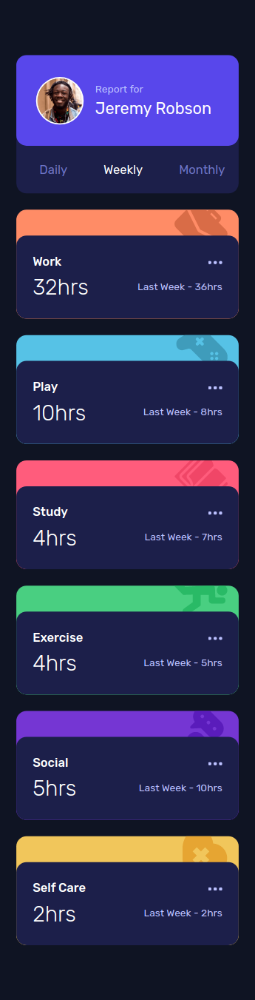
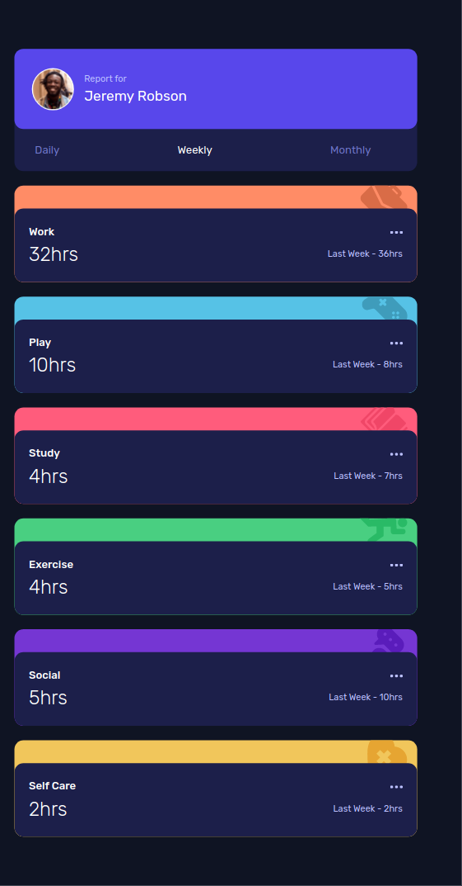
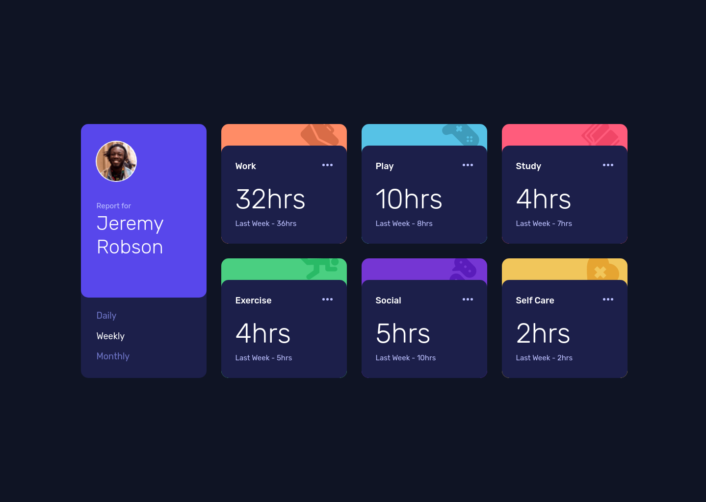
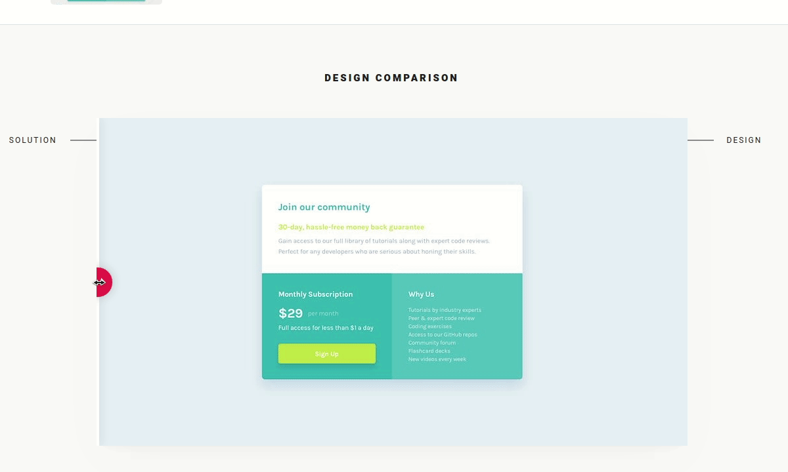

# Frontend Mentor - Time tracking dashboard solution

This is a solution to the [Time tracking dashboard challenge on Frontend Mentor](https://www.frontendmentor.io/challenges/time-tracking-dashboard-UIQ7167Jw). Frontend Mentor challenges help you improve your coding skills by building realistic projects.

## Table of contents

- [Overview](#overview)
  - [The challenge](#the-challenge)
  - [Screenshot](#screenshot)
  - [Links](#links)
- [My process](#my-process)
  - [Built with](#built-with)
  - [What I learned](#what-i-learned)
  - [Useful resources](#useful-resources)
- [Author](#author)

## Overview

This is the front-end mentor's seventeen challenge. The challenge is to build the "Time tracking dashboard" and make it as close to the design as possible. Building the desing with whatever you want to finish, any language, framework or tools.

### The challenge

Users should be able to:

- View the optimal layout for the component depending on their device's screen size
- See a hover state on desktop for the Sign Up call-to-action

## Screenshot
<!--
### Mobile design

<p  align="center">
  </img>
</p>

### Tablets design

<p  align="center"></img></p>

### Desktop design

<p  align="center"></img></p>

### result of my work

<p  align="center"></img></p> -->

### Links
<!--
- Solution URL: [My solution for this challenge](https://www.frontendmentor.io/solutions/single-price-grid-with-reactjs-YR5dhXAtZ)
- Live Site URL: [check the result](https://jcdmeira-single-price.netlify.app)
- My figma design: [Figma](https://www.figma.com/file/qoi5g7sQ81YZysFwJJoWIz/07---Single-price?node-id=0%3A1) -->

## My process

### Built with

- Mobile-first workflow
- [React](https://reactjs.org/) - JS library
- [Styled components](https://styled-components.com) - CSS in js with stiled components

### What I learned
<!--
Using the grid template areas to define occupied spaces with an alias

```CSS
  .content {
  display: grid;
  gap: 0;
  grid-template-areas:
    'field1'
    'field2'
    'field3';
}

.field1 {
  grid-area: field1;
}
.field2 {
  grid-area: field2;
}
.field3 {
  grid-area: field3;
}
@media (min-width: 900px) {
  .content {
    grid-template-areas:
      'field1 field1'
      'field2 field3';
  }
}
``` -->

### Useful resources

- [react tutorial](https://pt-br.reactjs.org/tutorial/tutorial.html) - This helped me structure the components and build the proposed page.
<!-- - [my figma design](https://www.figma.com/file/qoi5g7sQ81YZysFwJJoWIz/07---Single-price?node-id=0%3A1) - My figma design for help anyone who wants to build this challenge. -->
- [CSS units conversor - px to VH/VW/REM](https://it-news.pw/pxtovh/) - CSS units conversor .
- [Converting Colors](https://convertingcolors.com) - HSL for all color systems.

## Author

- Personal Page - [Jean Carlos De Meira](https://jcdmeira.github.io)
- Frontend Mentor - [@JCDMeira](https://www.frontendmentor.io/profile/JCDMeira)
- Instagram - [@jean.meira10](https://www.instagram.com/jean.meira10/)
- GitHub - [JCDMeira](https://github.com/JCDMeira)
